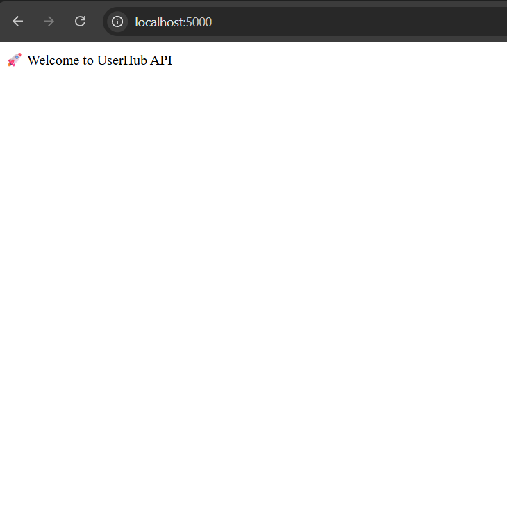
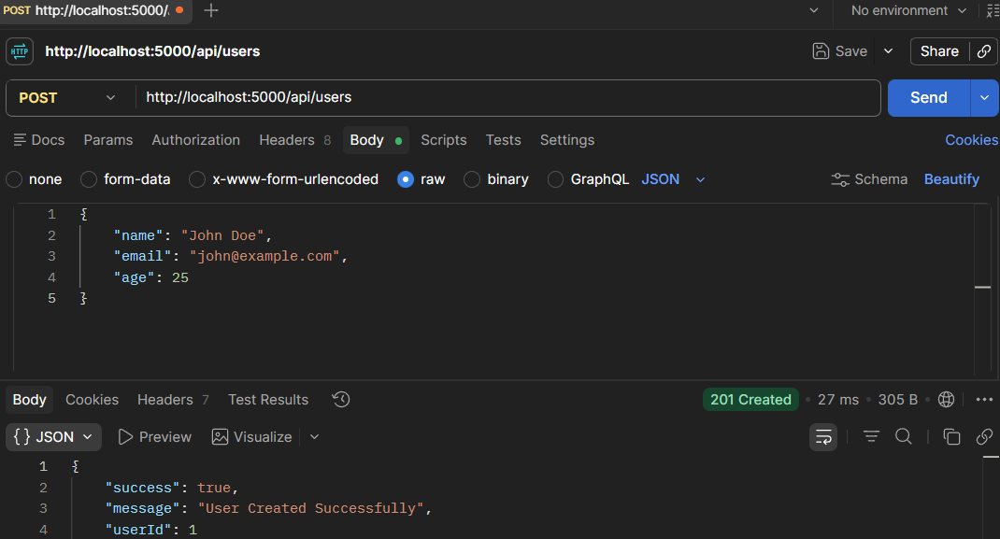
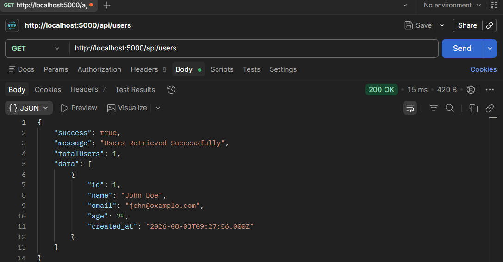
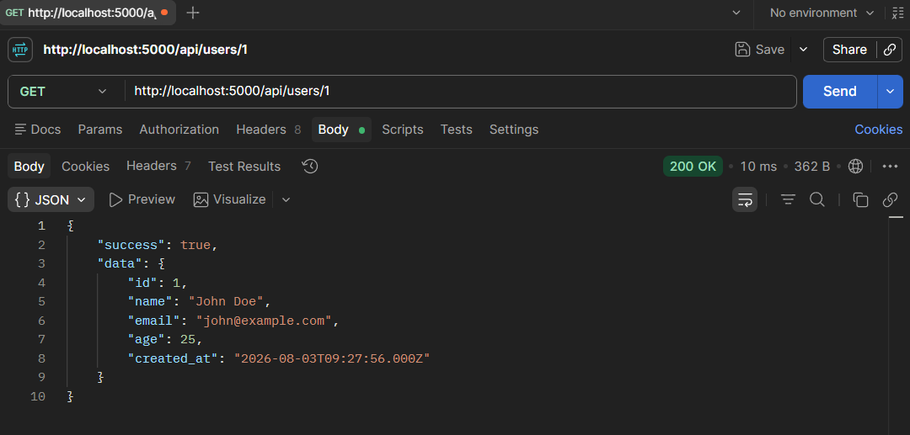
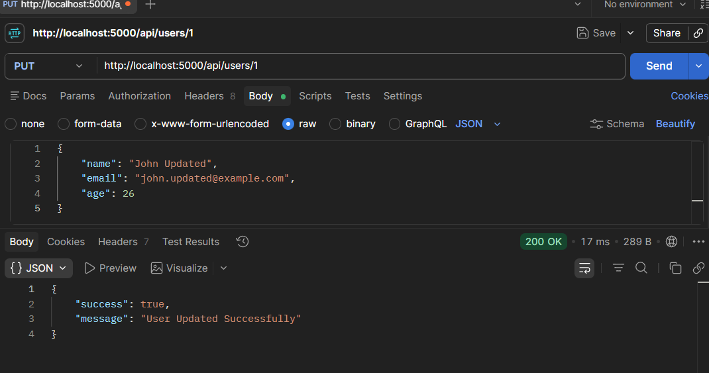
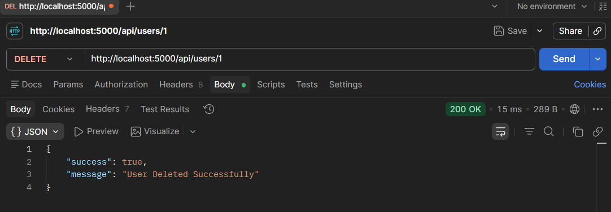
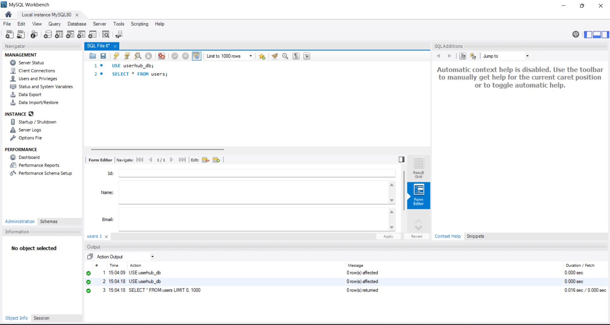
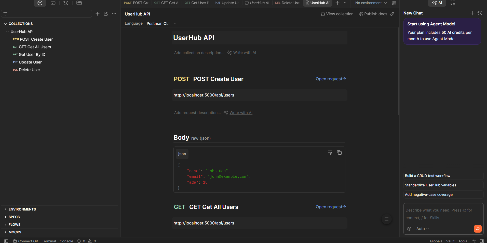

# 🚀 UserHub API

> A RESTful User Management API built with **Node.js**, **Express.js**, and **MySQL** following the **MVC (Model-View-Controller)** architecture.


---

# 📖 Overview

UserHub API is a backend REST API that provides complete **CRUD (Create, Read, Update, Delete)** operations for managing user information.

The project demonstrates industry-standard backend development practices including:

- REST API Development
- MVC Architecture
- MySQL Database Integration
- Validation
- Error Handling
- Environment Variables
- Git Version Control

This project was developed as part of an internship to gain practical experience in backend web development.

---

# ✨ Features

- ✅ MVC Architecture
- ✅ RESTful API Design
- ✅ MySQL Database Integration
- ✅ Express.js Backend
- ✅ CRUD Operations
- ✅ Input Validation
- ✅ Duplicate Email Validation
- ✅ Structured JSON Responses
- ✅ Error Handling
- ✅ Environment Variables
- ✅ Professional Folder Structure

---

# 🛠 Tech Stack

## Backend

- Node.js
- Express.js

## Database

- MySQL

## Tools

- VS Code
- MySQL Workbench
- Postman
- Git
- GitHub

## Packages

- express
- mysql2
- dotenv
- nodemon

---

# 📂 Project Structure

```text
Task5_UserHub_API/
│
├── config/
│   └── db.js
│
├── controllers/
│   └── userController.js
│
├── database/
│   └── schema.sql
│
├── models/
│   └── userModel.js
│
├── output/
│   ├── home-route.png
│   ├── create-user.png
│   ├── get-all-users.png
│   ├── get-user-by-id.png
│   ├── update-user.png
│   ├── delete-user.png
│   ├── database.png
│   └── postman-testing.png
│
├── routes/
│   └── userRoutes.js
│
├── .env
├── .gitignore
├── app.js
├── package.json
├── package-lock.json
└── README.md
```

---

# 📸 Project Screenshots

## 🏠 Home Route

Displays the API welcome message.

```text
http://localhost:5000
```



---

## ➕ Create User API

Creates a new user successfully.



---

## 👥 Get All Users API

Returns all users stored in the database.



---

## 🔍 Get User By ID

Returns a specific user.



---

## ✏️ Update User

Updates existing user information.



---

## 🗑 Delete User

Deletes a user successfully.



---

## 🛢 Database

MySQL Workbench showing the **users** table.



---

## 📮 API Testing

CRUD API testing using Postman.



---

# ⚙ Installation

## Clone Repository

```bash
git clone https://github.com/yourusername/Task5_UserHub_API.git
```

Move into project

```bash
cd Task5_UserHub_API
```

Install dependencies

```bash
npm install
```

---

# 🔐 Environment Variables

Create a **.env** file.

```env
DB_HOST=localhost
DB_USER=root
DB_PASSWORD=YOUR_PASSWORD
DB_NAME=userhub_db
DB_PORT=3306

PORT=5000
```

---

# ▶ Running the Application

Development

```bash
npm run dev
```

Production

```bash
npm start
```

---

# 🗄 Database Setup

Run the following SQL script.

```sql
CREATE DATABASE userhub_db;

USE userhub_db;

CREATE TABLE users(
    id INT AUTO_INCREMENT PRIMARY KEY,
    name VARCHAR(100) NOT NULL,
    email VARCHAR(100) UNIQUE NOT NULL,
    age INT NOT NULL,
    created_at TIMESTAMP DEFAULT CURRENT_TIMESTAMP
);
```

---

# 🌐 API Endpoints

## Create User

### POST

```
/api/users
```

Request

```json
{
    "name":"John",
    "email":"john@gmail.com",
    "age":22
}
```

---

## Get All Users

### GET

```
/api/users
```

---

## Get User By ID

### GET

```
/api/users/:id
```

---

## Update User

### PUT

```
/api/users/:id
```

Request

```json
{
    "name":"John Updated",
    "email":"johnupdated@gmail.com",
    "age":23
}
```

---

## Delete User

### DELETE

```
/api/users/:id
```

---

# 📥 Sample Success Response

```json
{
    "success": true,
    "message": "User Created Successfully",
    "userId": 1
}
```

---

# ❌ Sample Error Response

```json
{
    "success": false,
    "message": "Email already exists."
}
```

---

# ✔ Validation Rules

The API validates:

- Name must contain at least 3 characters.
- Email must be a valid email address.
- Age must be between 1 and 120 years.
- Email must be unique.

---

# 🧪 Testing

The project was tested using **Postman** and **MySQL Workbench**.

### Successfully Tested

- Create User
- Get All Users
- Get User By ID
- Update User
- Delete User
- Invalid Email Validation
- Duplicate Email Validation
- Invalid User ID
- Invalid Age
- Invalid Name

---

# 📚 Learning Outcomes

Through this project, I learned:

- Express.js Fundamentals
- REST API Development
- MVC Architecture
- CRUD Operations
- MySQL Integration
- SQL Queries
- Database Connectivity
- Error Handling
- Request Validation
- Environment Variables
- API Testing using Postman
- Git & GitHub Workflow

---

# 🚀 Future Improvements

- JWT Authentication
- User Login & Registration
- Password Hashing using bcrypt
- Role-Based Authentication
- Pagination
- Search & Filter
- Swagger API Documentation
- Docker Support
- Unit Testing
- Cloud Deployment

---

# 👨‍💻 Author

**Somisetti Naga Veera Sri Charan**

Diploma in Computer Engineering

Backend Developer

GitHub: https://github.com/charansomisetti144-eng

---

# 📄 License

This project is developed for educational and internship purposes.

---

# ⭐ Support

If you found this project useful, consider giving it a **Star ⭐** on GitHub.

It helps motivate future improvements and supports the project.